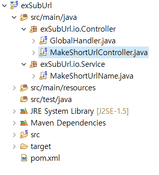
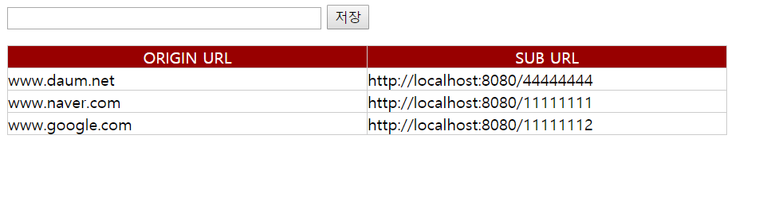

프로젝트 설명
===========================

## 개요
실존하는 웹 서비스 URL을 이력 받고 가상의 URL을 생성합니다.

가상의 URL을 이용해서 입력했던 웹 서비스를 사용할 수 있습니다.

## 환경
java version : 1.5

spring version 3.2.3.RELEASE

## 소스
프로젝트명 : exSubUrl

**■ MakeShortUrlController**

@RequestMapping("/exSubUrl/view.do") : URL 조회 및 입력 핸들러

@RequestMapping("/exSubUrl/insertData.do") : URL 입력 핸드러

@RequestMapping("/{subName}") : 대체된 URL 매핑 핸들러

**■ MakeShortUrlName**

public boolean duplicateExistsYn(HashMap asMap, ArrayList list) : 존재하는 URL인지 판단하는 함수

public String makeShortUrl(ArrayList list , int nowSec) : key 생성하는 함수

private String makeShortUrl_step1(int nowSec) : key 생성시 기준 key 생성하는 함수

private String makeshortUrlName_step2(String asIsKey) : key 생성시 존재하는 key이면 다른 key 생성하는 함수

public String getOriUrl(String searchKey, ArrayList list) : 대체 URL 호출 시 실제 URL 호출하는 함수

**■ 키 생성원리**

현재 시스템 시간의 초를 입력받습니다.

String mainString = "1234567890AaBbCcDdEeFfGghHiIjJkKLlmMNnOopPqQRrSsTtuUvVWwXxyY";에서

현재 시간을 60으로 나누어 나머지를 mainString의 인덱스에 행하는 문자를 나타냅니다.

ex) 59초 --> 60%59=1 --> mainString의 index 1의 문자로 8번을 붙여 key 생성 --> "22222222"

해당하는 key가 존재할 경우 뒷자리 부터 순차적으로 문자열을 올립니다.

**■ DBMS 를사용하지 않는대신.....**

저장소 역할은 영역 객체 중 하나인 application을 이용합니다.

application에 ArrayList타입으로 저장을 합니다.

ArrayList<HashMap()> --> HashMap 키 oriUrl, subUrl, subKey

oriUrl : 본 URL

subUrl : 가공된 URL

subKey : 채번된 Key

**■ 사용자 화면**

